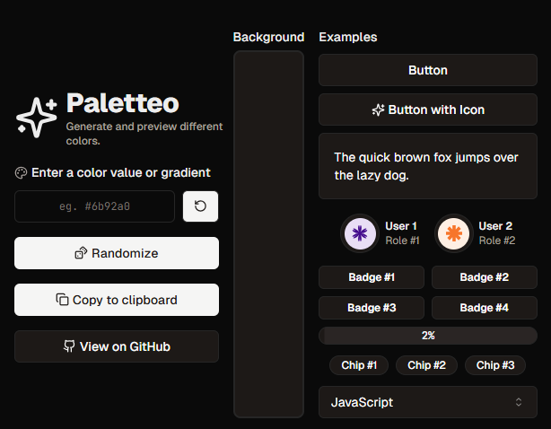

# [Paletteo](https://paletteo.vercel.app/)

A beautiful and minimalistic color previewer and generator. Take the color values you get from **Paletteo** to use in your own code or projects!  

## Tech Stack

- Next.js
- TailwindCSS & shadcn/ui
- Framer Motion
- Lucide Icons

## Supported Color Types

| Color Type          | Syntax                                                    | Example                                                                         |
|---------------------|-----------------------------------------------------------|---------------------------------------------------------------------------------|
| **Hex**             | `#RRGGBB` or `#RRGGBBAA`                                  | `#09faa9`, `#7a84d280`                                                          |
| **RGB**             | `rgb(R, G, B)`                                            | `rgb(251, 246, 213)`                                                            |
| **RGBA**            | `rgba(R, G, B, A)`                                        | `rgba(12, 96, 207, 0.63)`                                                       |
| **HSL**             | `hsl(H, S%, L%)`                                          | `hsl(213, 56%, 62%)`                                                            |
| **HSLA**            | `hsla(H, S%, L%, A)`                                      | `hsla(299, 76%, 65%, 0.35)`                                                     |
| **Linear Gradient** | `linear-gradient(direction, color1, color2...)`           | `linear-gradient(to bottom left, #39e4cb, #1077f7)`                             |
| **Radial Gradient** | `radial-gradient(shape at position, color1, color2...)`   | `radial-gradient(circle at bottom left, rgb(65, 116, 215), rgb(114, 139, 216))` |

# Statistics

### PageSpeed Insights & Lighthouse
##### _These numbers are (same) for both Mobile & Desktop unless specifically mentioned._ ([Learn more & verify!](https://pagespeed.web.dev/analysis?url=https%3A%2F%2Fpaletteo.vercel.app%2F))  
🚀 Performance    - 100 - Desktop | 93 - Mobile  
♿ Accessibility  - 96  
🌟 Best Practices - 100  
🌐 SEO            - 100